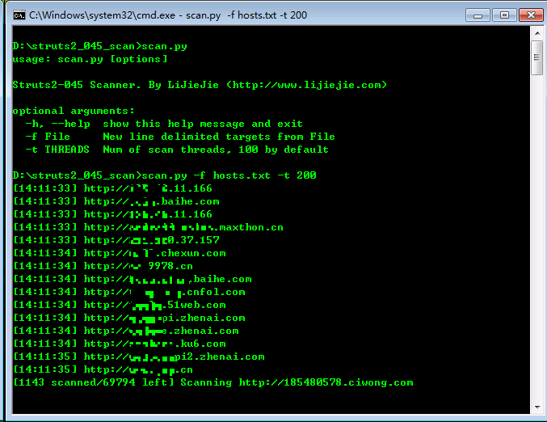

# struts2\_045\_scan #

A multi-thread struts2_045 scanner. 

Struts2-045漏洞批量扫描工具.

# Requirements #

	pip install requests

# Usage #

	usage: scan.py [options]
	
	Struts2-045 Scanner. By LiJieJie (http://www.lijiejie.com)
	
	optional arguments:
	  -h, --help  show this help message and exit
	  -f File     New line delimited targets from File
	  -t THREADS  Num of scan threads, 100 by default

# Screenshot #

